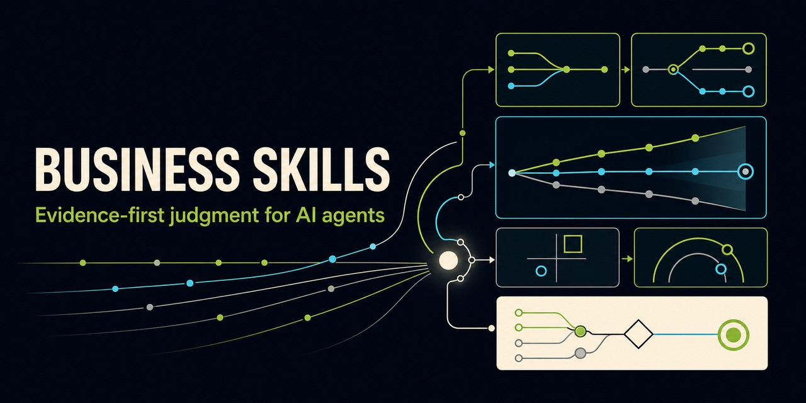

<div align="center">
  
  <h1>Business Skills</h1>
  <p><strong>Evidence-first judgment for AI agents.</strong></p>
  <p>Open, evidence-first skills for strategy, markets, forecasting, and business judgment.</p>

  [](https://github.com/artemiosu/business-skills/actions/workflows/validate.yml)
  [](LICENSE)
  [](https://agentskills.io)
  [](CONTRIBUTING.md)
  [](https://skills.sh/artemiosu/business-skills)
</div>

> Business advice is cheap. Auditable judgment is rare.

Business Skills is a growing, cross-agent collection of reusable workflows designed to make consequential business reasoning more explicit, falsifiable, and testable. Every skill should turn uncertainty into evidence, forecasts, decision rules, and learning loops—not confident-sounding prose.

Created and maintained by **[@artemiosu](https://github.com/artemiosu)**.

## See the decision, not just the prompt

| Question | Horizon Scout | Decision artifact |
|---|---|---|
| “Should a three-person team build an AI bookkeeping agent now?” | 7 dated signals · 5 source groups · adoption, timing, capture, and counterfactual gates · 3 resolvable forecasts | **MONITOR + bounded probe** — the trend is real, but standalone value capture is not proven |

**[Read the live, cutoff-dated case →](examples/ai-accounting-agents-2026/README.md)** · [Inspect its evidence](examples/ai-accounting-agents-2026/signals.jsonl) · [Track its forecasts](examples/ai-accounting-agents-2026/forecast-ledger.jsonl)

This is the core promise: replace “AI says this market is growing” with an auditable decision, explicit uncertainty, and a record that can later be scored.

## Start in 60 seconds

### Install with the Agent Skills CLI

```bash
npx skills add artemiosu/business-skills
```

The CLI supports multiple skill-aware agents and records anonymous install telemetry by default; set `DISABLE_TELEMETRY=1` to opt out. A local installer is also available below.

### Codex/manual fallback

```bash
git clone https://github.com/artemiosu/business-skills.git
python3 business-skills/scripts/install.py --agent codex
```

Restart or reload Codex, then try:

```text
$horizon-scout Scan autonomous AI agents in US accounting over 24 months.
Separate real adoption, market timing, and value capture. Create a forecast ledger.
```

The installer supports `--agent codex|claude-code|cursor|copilot|windsurf|gemini|agents`, never overwrites an existing skill unless `--force` is supplied, and requires only Python 3.9+.

## Skills

| Skill | Use it when you need to… | Status |
|---|---|---|
| [Horizon Scout](skills/horizon-scout/README.md) | detect emerging technology or market shifts, challenge hype, build scenarios, and log calibrated forecasts | Experimental — mechanics tested, field calibration in progress |
| [Evidence Echo Forensics](skills/evidence-echo-forensics/README.md) | trace apparent consensus back to independent observations, datasets, interviews, or releases and expose claim mutation | Experimental — deterministic lineage mechanics tested |
| [Autonomy Governor](skills/autonomy-governor/README.md) | turn an AI-agent workflow into testable authority, limits, approvals, enforcement, rollback, and stop conditions | Experimental — deterministic policy mechanics tested |

More skills will follow. Each addition must pass the same evidence, safety, documentation, and evaluation standards.

## Works across agents

The portable source of truth is the open Agent Skills `SKILL.md` format. Codex-specific plugin/UI metadata is additive and never required by the core workflow.

| Host | Supported path |
|---|---|
| Codex / ChatGPT | Agent Skills core + optional Codex plugin metadata |
| Claude Code | Agent Skills core |
| Cursor | Agent Skills core; user or project skill directories |
| GitHub Copilot / Copilot CLI | Agent Skills core; `gh skill` or supported directories |
| Windsurf, Gemini CLI, other compatible hosts | Agent Skills core through the host or Agent Skills CLI |

Exact outputs cannot be identical across models and tool environments. Business Skills targets the same decision contract, evidence rules, safety boundaries, structured artifacts, and deterministic tests on every compatible host. See [Compatibility](docs/COMPATIBILITY.md).

## Why these skills are different

```text
Weak signals → source lineage → anti-hype gates → competing hypotheses
             → adoption / timing / value capture → scenarios
             → calibrated forecasts → reversible actions → resolution
```

- Treats trend reality, adoption, timing, and profit capture as separate questions.
- Records counterevidence and shared source ancestry instead of counting headlines.
- Uses simulated expert lenses to reveal cruxes—never as fake expert endorsement.
- Keeps scores separate from probabilities.
- Preserves forecasts so calibration can be measured later.
- Includes a dependency-free CLI and adversarial test suite.

Evidence Echo Forensics adds the upstream provenance layer:

```text
12 citations → atomic claim occurrences → typed lineage
             → 1–N support units → consensus-collapse test
```

It audits independence without pretending that provenance proves truth or intent.

Autonomy Governor adds a boundary between what an agent can technically do and what it is authorized to do:

```text
tool capability → complete action universe → authority contract
                → ALLOW / APPROVAL_REQUIRED / DENY / HOLD
```

It tests policy artifacts without pretending to be IAM, a runtime firewall, or permission to execute an action.

## Pick your starting point

- **Founder:** `$horizon-scout Is this market ready inside my 18-month runway, and can a new entrant capture value?`
- **Strategist:** `$horizon-scout Map the stalled, base, and accelerated scenarios for this shift and define monitoring triggers.`
- **Investor or researcher:** `$horizon-scout Build a cutoff-safe evidence map, competing hypotheses, and resolvable forecasts for this thesis.`
- **Evidence auditor:** `$evidence-echo-forensics Trace this widely repeated claim to its underlying observations and show whether the apparent consensus survives.`
- **Agent owner:** `$autonomy-governor Compile this workflow and tool list into a bounded authority contract; expose excessive agency and model-only controls.`

Start with the [live AI-accounting case](examples/ai-accounting-agents-2026/README.md), the [Horizon Scout synthetic walkthrough](examples/horizon-scout-synthetic-case.md), the [Evidence Echo synthetic case](examples/evidence-echo-forensics-synthetic-case.md), its [independent two-part forward test](examples/evidence-echo-forensics-forward-test.md), or the [Autonomy Governor synthetic walkthrough](examples/autonomy-governor-synthetic-case.md).

## Use without installing everything

Copy the desired folder from `skills/` to your agent's supported skills directory. Every skill is self-contained and follows the same portable source-of-truth convention.

```bash
python3 skills/horizon-scout/scripts/eval_harness.py
python3 skills/horizon-scout/scripts/horizon_scout.py assess \
  skills/horizon-scout/assets/example_signals.jsonl
python3 skills/evidence-echo-forensics/scripts/eval_harness.py
python3 skills/evidence-echo-forensics/scripts/evidence_echo.py audit \
  skills/evidence-echo-forensics/assets/example_records.jsonl
python3 skills/autonomy-governor/scripts/eval_harness.py
python3 skills/autonomy-governor/scripts/autonomy_governor.py simulate \
  skills/autonomy-governor/assets/example_contract.json \
  skills/autonomy-governor/assets/example_scenarios.jsonl
```

## Trust model

These skills improve process; they do not predict the future, determine truth automatically, grant authority, enforce permissions, or guarantee business outcomes. Current evaluations prove mechanics, not field accuracy. Treat outputs as decision support. Verify important evidence and use qualified professional review for financial, legal, medical, or safety-critical decisions. See [Security](SECURITY.md), the [Horizon Scout methodology](skills/horizon-scout/references/workflow.md), the [Evidence Echo workflow](skills/evidence-echo-forensics/references/workflow.md), and the [Autonomy Governor workflow](skills/autonomy-governor/references/workflow.md).

## Contribute

Start with [Contributing](CONTRIBUTING.md), propose a skill through the [skill proposal form](https://github.com/artemiosu/business-skills/issues/new?template=skill-proposal.yml), or improve an existing workflow. Small, evidence-backed pull requests are preferred.

## Project

- [Roadmap](ROADMAP.md)
- [Governance](GOVERNANCE.md)
- [Support](SUPPORT.md)
- [Changelog](CHANGELOG.md)
- [Citation](CITATION.cff)

Apache-2.0 licensed. Created and maintained by [@artemiosu](https://github.com/artemiosu). See [Authorship](AUTHORSHIP.md).
